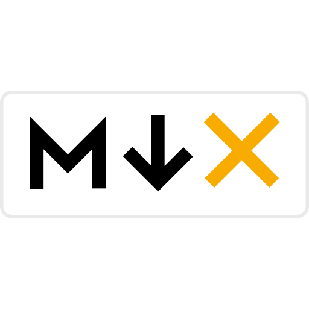

 

 

  <h1>beshoi.dev 💻</h1>
  
 

  
 Next.js + TypeScript + Mdx + Stitches + Utopia + Vercel 

  
  
  
  
  
  

## Features

This repo created with:

- ⚡️ Next.js 12
- ⚛️ React 18
- ✨ TypeScript
- 💎 Stitches
- 🚀 Zero Media Queries
- 🔥 Mdx
- 📡 Rss
- 🗺 Site Map
- 📈 Absolute Import
- 💖 Prettier
- 🐶 Husky & Lint Staged
- 🌏 vercel
